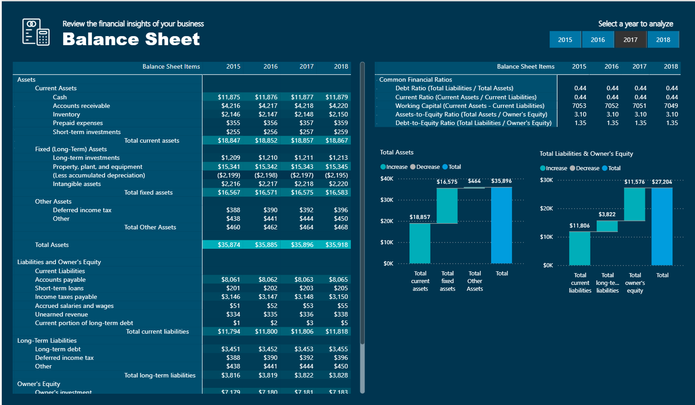

# 📊 Financial Reporting & Modelling in Power BI

A comprehensive and interactive **Power BI solution** built to analyze and automate **financial reporting** across income statements, balance sheets, cash flows, trial balances, and revenue insights.

The dashboard empowers finance teams and executives to track **profitability, liquidity, cash flow health, and revenue drivers**, enabling smarter and faster decision-making.

---

## 🔎 Short Description / Purpose

The **Financial Reporting Dashboard** consolidates financial data from multiple sources into a single analytical platform.

Its purpose is to:
- Accelerate reporting cycles.
- Automate financial statements (Income, Balance Sheet, Cash Flow).
- Provide actionable insights into revenue trends and financial health.
- Deliver intuitive, user-friendly reports with drilldowns and navigations.

---

## 🛠️ Tech Stack

The dashboard was built using:

- 📊 **Power BI Desktop & Power BI Service** – Data modeling, visualization, and publishing.
- 📂 **Power Query** – Data cleaning, transformation, and integration.
- 🧮 **DAX (Data Analysis Expressions)** – Advanced measures, KPIs, and time intelligence.
- 🗄️ **Excel / CSV (Mock Data)** – Data source for transactional and financial data.
- 🎨 **Custom Themes & Icons** – Applied for professional report design and navigation.

---

## 📂 Data Source

**Mock financial dataset** (for demonstration):
- Multi-year **Income Statement, Balance Sheet, and Cash Flow data**.
- Accounts receivable/payable for **Aged Trial Balance analysis**.
- **Revenue performance data** across products/segments.
- Banking industry sample data for **scenario modelling** and what-if analysis.

---

## ✨ Features / Highlights

### 🔹 Business Problem
Traditional financial reporting is often **manual, fragmented, and time-consuming**, which delays insights and decision-making.

### 🔹 Goal of the Dashboard
To deliver a **unified financial reporting solution** that:
- Automates **Income Statement, Balance Sheet, and Cash Flow** reporting.
- Provides **real-time KPIs** like Gross Margin %, Net Profit %, Liquidity Ratios.
- Supports **scenario modelling & what-if analysis** for forecasting.
- Enhances **report navigation** through bookmarks and icons.

### 🔹 Walkthrough of Key Visuals
- **Income Statement** – Rollups, subtotals, positive/negative handling, and financial templates.
- **Balance Sheet** – Subtotal calculations, SWITCH/TRUE logic, and ratio summaries.
- **Cash Flow Statement** – Correct summary totals, negative number visuals, and breakdown tables.
- **Aged Trial Balance** – Receivable reconciliations, dynamic grouping, and advanced DAX modelling.
- **Revenue Insights** – Ranking formulas, unique DAX combinations, and revenue driver analysis.
- **Financial Modelling (Banking Industry)** – What-if parameters, sliders, and scenario analysis.
- **Report Design & Navigation** – Professional color themes, icons, and intuitive bookmarks.

---

## 📈 Business Impact & Insights

- ⏱️ **Accelerated reporting** through automation of financial statements.
- 📊 **Improved data accuracy** by reducing manual cleanup and applying structured data models.
- 💡 **Enhanced insights** with dynamic visuals, ratios, and revenue breakdowns.
- 🌍 **Scalable design** adaptable across industries like finance, banking, and corporate reporting.

---

## 📸 Screenshots / Demos

🔗 **Live Dashboard (Power BI Service)**: [View Online](https://app.powerbi.com/view?r=eyJrIjoiZWFjYTQyZmYtZjFiYS00YmViLWEwY2ItOGMxNGUxMDhjYmQwIiwidCI6ImI1MTdmYzgwLTQ2M2UtNGJhZC05YTY2LWUzNGQ4YThlYmIxMiJ9)  
📂 **PBIX File (Google Drive)**: [Download Here](https://drive.google.com/file/d/1cbX0wGq9YwDkNyScTHMzHB5oH3b4r9Cn/view?usp=drive_link)  
📸 **Preview Screenshots**:  

### 🧾 Income Statement

### 📊 Balance Sheet

### 💰 Cash Flow Statement

### 📑 Aged Trial Balance

### 📈 Financial Details

### 📉 Revenue Insights

---

## 🚀 How to Use

1. Clone this repository.
2. Download the `.pbix` file (link above).
3. Open in **Power BI Desktop**.
4. Explore financial statements, ratios, and scenario modelling.

---

## 🔖 Tags

#PowerBI #FinancialReporting #DataAnalytics #BusinessIntelligence #Finance #DAX #Visualization
